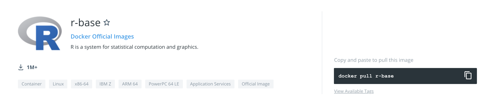
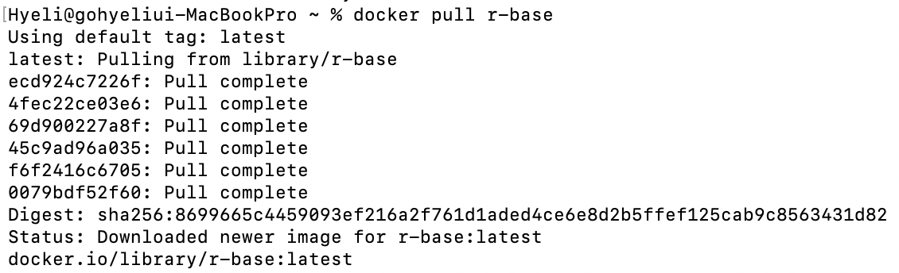
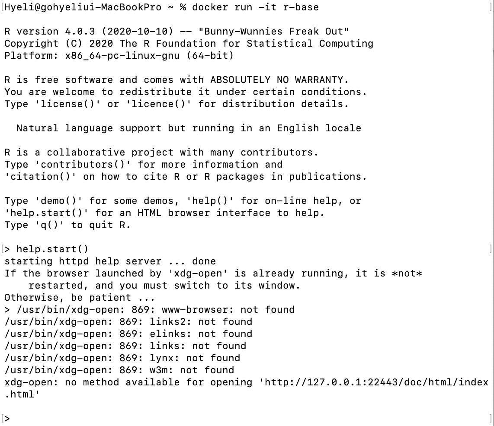
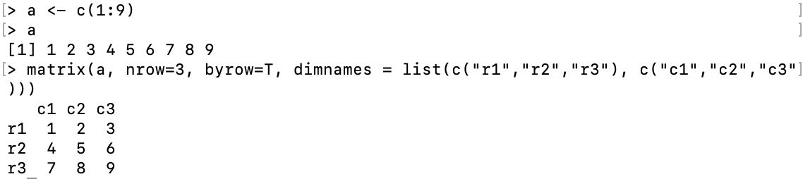

# 도커에서 R 실행하기 

0️⃣\
도커 허브 카테고리 중 Application Services를 선택하고 구경하던 중, 
R이라는 프로그램이 조금 익숙해서 실행하기로 결정

---
1️⃣\
도커 이미지를 받기 위해 `docker pull r-base` 를 터미널에 입력

---
2️⃣\
도커 컨테이너를 실행하기 위해 `docker run -it r-base` 입력해서 R 실행

---
3️⃣\
R에서 매트릭스 만들어보기

| |c1|c2|c3|
|:---:|:---:|:---:|:---:|
|r1|1|2|3|
|r2|4|5|6|
|r3|7|8|9|
⬆️ 위 표와 같이 이루어진 매트릭스 만들기

